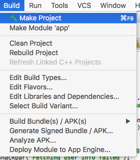
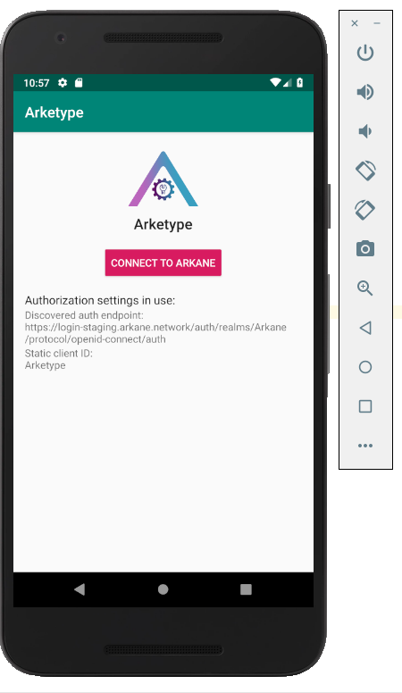

== Introduction

This quickstart will guide you on building your own native mobile application (Android) that uses Arkane. After this intro you should understand how Arkane works and be able to
integrate all features from the link:reference[Reference documentation].


=== What you'll build

We will build an Android app that will:

. authenticate the user with Arkane
. manage Arkane wallets for our app
. fetch a list of the user's wallets


=== Prerequisities

* Development tools for android (https://developer.android.com/studio/intro/)
* a minimal understanding of Java / Android apps

== Let's get started

First of all, let's setup a our development environment. Open a terminal window, checkout the Arketype project from GitHub and build the project.
```
git clone https://github.com/ArkaneNetwork/ArketypeMobile.git
cd ArketypeMobile
```
Building your project:



Running the project:


After clicking run, you have to setup a virtual device (or connect your android phone). When everything is setup correctly, the app should start on your device:



== Authentication
Arkane uses link:https://openid.net/connect/[OpenID connect] for user authentication. For more information on the authorization flow, please check the reference documentation.

You can implement the OpenId connect flow yourself or use an existing library that supports this:

- link:https://appauth.io/[AppAuth]
- link:https://aerogear.org/[Aerogear]

In this example we will be using *AppAuth*. First we need to add it as a dependency inside the `build.gradle` of the app:

=== Configure AppAuth library

.app/build.gradle

./package.json
[source,groovy]
----
dependencies {
    implementation group: 'net.openid', name: 'appauth', version: '0.7.1'
}

----
We also need a config file that will configure the library:

./package.json
[source,json]
----
{
  "client_id": "Arketype",
  "redirect_uri": "network.arkane.arketype://oauth2redirect",
  "authorization_scope": "openid",
  "discovery_uri": "https://login-staging.arkane.network/auth/realms/Arkane/.well-known/openid-configuration",
  "https_required": true
}
----
.Explanation of the fields
|===
|Field |Explanation

|client_id
|The id of the client, on staging you can use Arkane. For production please contact Arkane.

|redirect_uri
|To where does it need to redirect when authentication is done. Important note, *this must be equal to the value inside the defaultConfig of the app.gradle*: manifestPlaceholders = ["appAuthRedirectScheme": "network.arkane.arketype"]

|discovery_uri
|Discovery endpoint for all other endpoints that are necessary for authentication.

|===

=== Implement LoginActivity

==== onCreate
In the onCreate section we will setup everything that is necessary for the authentication:


./app/src/main/java/LoginActivity.java
[source,java]
----
        // <1>
        mAuthStateManager = AuthStateManager.getInstance(this);
        mConfiguration = Configuration.getInstance(this);

        // <2>
        if (mAuthStateManager.getCurrent().isAuthorized()
                && !mConfiguration.hasConfigurationChanged()) {
            Log.i(TAG, "User is already authenticated, proceeding to token activity");
            startActivity(new Intent(this, TokenActivity.class));
            finish();
            return;
        }

        // <3>
        if (!mConfiguration.isValid()) {
            displayError(mConfiguration.getConfigurationError(), false);
            return;
        }

        // <4>
        if (getIntent().getBooleanExtra(EXTRA_FAILED, false)) {
            displayAuthCancelled();
        }

        // <5>
        mExecutor.submit(this::initializeAppAuth);

        @WorkerThread
        private void initializeAppAuth() {
            Log.i(TAG, "Initializing AppAuth");
            recreateAuthorizationService();

            if (mAuthStateManager.getCurrent().getAuthorizationServiceConfiguration() != null) {
                // configuration is already created, skip to client initialization
                Log.i(TAG, "auth config already established");
                initializeClient();
                return;
            }

            // <6>
            // if we are not using discovery, build the authorization service configuration directly
            // from the static configuration values.
            if (mConfiguration.getDiscoveryUri() == null) {
                Log.i(TAG, "Creating auth config from res/raw/auth_config.json");
                AuthorizationServiceConfiguration config = new AuthorizationServiceConfiguration(
                        mConfiguration.getAuthEndpointUri(),
                        mConfiguration.getTokenEndpointUri(),
                        mConfiguration.getRegistrationEndpointUri());

                mAuthStateManager.replace(new AuthState(config));
                initializeClient();
                return;
            }

            // <7>
            // WrongThread inference is incorrect for lambdas
            // noinspection WrongThread
            runOnUiThread(() -> displayLoading("Retrieving discovery document"));
            Log.i(TAG, "Retrieving OpenID discovery doc");
            AuthorizationServiceConfiguration.fetchFromUrl(
                    mConfiguration.getDiscoveryUri(),
                    this::handleConfigurationRetrievalResult,
                    mConfiguration.getConnectionBuilder());
        }

        // <8>
        private void recreateAuthorizationService() {
            if (mAuthService != null) {
                Log.i(TAG, "Discarding existing AuthService instance");
                mAuthService.dispose();
            }
            mAuthService = createAuthorizationService();
            mAuthRequest.set(null);
            mAuthIntent.set(null);
        }

        private AuthorizationService createAuthorizationService() {
            Log.i(TAG, "Creating authorization service");
            AppAuthConfiguration.Builder builder = new AppAuthConfiguration.Builder();
            builder.setBrowserMatcher(AnyBrowserMatcher.INSTANCE); // <5.c.i>
            builder.setConnectionBuilder(mConfiguration.getConnectionBuilder());

            return new AuthorizationService(this, builder.build());
        }

        // <9>
        @WorkerThread
        private void initializeClient() {
            if (mConfiguration.getClientId() != null) {
                Log.i(TAG, "Using static client ID: " + mConfiguration.getClientId());
                // use a statically configured client ID
                mClientId.set(mConfiguration.getClientId());
                runOnUiThread(this::initializeAuthRequest);
                return;
            }

            RegistrationResponse lastResponse =
                    mAuthStateManager.getCurrent().getLastRegistrationResponse();
            if (lastResponse != null) {
                Log.i(TAG, "Using dynamic client ID: " + lastResponse.clientId);
                // already dynamically registered a client ID
                mClientId.set(lastResponse.clientId);
                runOnUiThread(this::initializeAuthRequest);
                return;
            }


            // WrongThread inference is incorrect for lambdas
            // noinspection WrongThread
            runOnUiThread(() -> displayLoading("Dynamically registering client"));
            Log.i(TAG, "Dynamically registering client");

            RegistrationRequest registrationRequest = new RegistrationRequest.Builder(
                    mAuthStateManager.getCurrent().getAuthorizationServiceConfiguration(),
                    Collections.singletonList(mConfiguration.getRedirectUri()))
                    .setTokenEndpointAuthenticationMethod(ClientSecretBasic.NAME)
                    .build();

            mAuthService.performRegistrationRequest(
                    registrationRequest,
                    this::handleRegistrationResponse);
        }

        // <11>
        @MainThread
        private void initializeAuthRequest() {
            createAuthRequest("");
            warmUpBrowser();
        }

        // <12>
        private void createAuthRequest(@Nullable String loginHint) {
            Log.i(TAG, "Creating auth request for login hint: " + loginHint);
            AuthorizationRequest.Builder authRequestBuilder = new AuthorizationRequest.Builder(
                    mAuthStateManager.getCurrent().getAuthorizationServiceConfiguration(),
                    mClientId.get(),
                    ResponseTypeValues.CODE,
                    mConfiguration.getRedirectUri())
                    .setScope(mConfiguration.getScope());

            if (!TextUtils.isEmpty(loginHint)) {
                authRequestBuilder.setLoginHint(loginHint);
            }
            HashMap<String, String> additionalParameters = new HashMap<>();
            // you can enforce your users to use a specific IDP like: google or facebook
            // additionalParameters.put("kc_idp_hint", "google");
            authRequestBuilder.setAdditionalParameters(additionalParameters);
            mAuthRequest.set(authRequestBuilder.build());
        }

        // <13>
        private void warmUpBrowser() {
            mAuthIntentLatch = new CountDownLatch(1);
            mExecutor.execute(() -> {
                Log.i(TAG, "Warming up browser instance for auth request");
                CustomTabsIntent.Builder intentBuilder =
                        mAuthService.createCustomTabsIntentBuilder(mAuthRequest.get().toUri());
                intentBuilder.setToolbarColor(getColorCompat(R.color.colorPrimary));
                mAuthIntent.set(intentBuilder.build());
                mAuthIntentLatch.countDown();
            });
        }

        // <10>
        @MainThread
        private void handleRegistrationResponse(
                RegistrationResponse response,
                AuthorizationException ex) {
            mAuthStateManager.updateAfterRegistration(response, ex);
            if (response == null) {
                Log.i(TAG, "Failed to dynamically register client", ex);
                displayErrorLater("Failed to register client: " + ex.getMessage(), true);
                return;
            }

            Log.i(TAG, "Dynamically registered client: " + response.clientId);
            mClientId.set(response.clientId);
            initializeAuthRequest();
        }
----

* Create the state manager for the authentication and parse the configuration (the json file) [.conum]#1#
* If the user is already authenticated, start the next intent [.conum]#2#
* If configuration is invalid, show an error [.conum]#3#
* When auth failed, call a function to handle this [.conum]#4#
* Setup of the AppAuth library [.conum]#5#
** You can specify each endpoint seperatly if preferred [.conum]#6#
** Use discovery endpoint for getting all the correct endpoints [.conum]#7#
** Create the authorization service [.conum]#8#
*** Select which browser to use for authentication, use ANY for auto selection [.conum]#9#
** Initialize the client with client id etc.
*** Initialize the authentication request [.conum]#11#
*** Create the authentication request [.conum]#12#
*** Warmup browser (performance optimization) [.conum]#13#
** Handle the registration response [.conum]#10#

[NOTE]
====
This code block only contains snippets, please checkout the full source on GitHub
====

==== Authenticating a user

When a user clicks a button, a custom tab should open where the user can log into Arkane. When this is done correctly, he should return to the app.

./app/src/main/java/LoginActivity.java
[source,java]
----
    // <1>
    findViewById(R.id.start_auth).setOnClickListener((View view) -> startAuth());

    // <2>
    @MainThread
    void startAuth() {
        displayLoading("Making authorization request");

        // WrongThread inference is incorrect for lambdas
        // noinspection WrongThread
        mExecutor.submit(this::doAuth);
    }

    // <3>
    @WorkerThread
    private void doAuth() {
        try {
            mAuthIntentLatch.await();
        } catch (InterruptedException ex) {
            Log.w(TAG, "Interrupted while waiting for auth intent");
        }
        Intent intent = mAuthService.getAuthorizationRequestIntent(
                mAuthRequest.get(),
                mAuthIntent.get());
        startActivityForResult(intent, RC_AUTH);
    }

----

<.> Add an on click listener when a user wants to authenticate
<.> Submit the authentication to the executor (separate thread)
<.> Create an authentication intent and start it


== Wallets

=== Manage wallets
As an application, it is possible to have a user manage his wallets for a specific chain. During this action, the user can link existing wallets or import a wallet.
When the user returns to the app, a wallet will be linked to your application for the given chain. When a user does not have any wallets yet, a user can indicate to create a new wallet.

To manage wallets, a specific url needs to be opened in the browser (using custom tabs). It is not possible to do this directly in the background since the user needs to enter his PIN. For security reasons, we cannot allow it to be entered inside your own app.

The endpoint to manage wallets:

 GET https://connect-staging.arkane.network/wallets/manage?redirectUri={redirectUri}&bearerToken={bearerToken}&data={data}


.Query parameters
|===
|Name |Description| Example

|redirectUri
|Needs to be replaced with a URI to which should be redirected after, in our example we will use this url to give focus back to our app
|network.arkane://callback

|bearerToken
|The bearer token (access token) you get back from the authentication service
|eyJhbGciOiJSUzI1NiIsInR5cCIgOiAiS...

|data
|a Base64 encoded json object containing the chain you would like to manage. Possible values are ethereum and vechain. E.g. Base 64 encoded {"chain": "ethereum"}
|eyJjaGFpbiI6ICJldGhlcmV1bSJ9
|===

[NOTE]
====
Make sure all query parameters are url encoded (ex. https://www.urlencoder.org/)
====

==== Example
./app/src/main/java/TokenActivity.java
[source,java]
----
    // <1>
    Button manageWalletsButton = (Button) findViewById(R.id.manage_wallets);
            manageWalletsButton.setOnClickListener((View view) -> manageWallets());

    public void manageWallets() {
        AuthState state = mStateManager.getCurrent(); // <2>
        state.performActionWithFreshTokens(mAuthService, (accessToken, idToken, ex) -> { // <3>
            String url = "https://connect-staging.arkane.network/wallets/manage?redirectUri=network.arkane://callback&data=eyJjaGFpbiI6ICJldGhlcmV1bSJ9&bearerToken=" + accessToken;
            CustomTabsIntent.Builder builder = new CustomTabsIntent.Builder();
            CustomTabsIntent customTabsIntent = builder.build();
            customTabsIntent.launchUrl(this, Uri.parse(url)); // <4>
        });
    }
----

<.> Add a click listener to manage wallets
<.> Get current authentication state
<.> Get a valid access token
<.> Open a custom tabs intent with the correct URL

=== Link wallets
This allows users to link his existing wallets with your application. The difference with <<Manage wallets>>:

* A user can only link wallets, it is not possible to create or import a wallet
* A list of all wallets is returned for any chain (it is possible to filter this).

An example use case could be a portfolio app where a user wants to quickly link all his wallets to get an overview of his complete portfolio.

The endpoint to link wallets:

 GET https://connect-staging.arkane.network/wallets/link?redirectUri={redirectUri}&bearerToken={bearerToken}


.Query parameters
|===
|Name |Description| Example

|redirectUri
|Needs to be replaced with a URI to which should be redirected after, in our example we will use this url to give focus back to our app
|network.arkane://callback

|bearerToken
|The bearer token (access token) you get back from the authentication service
|eyJhbGciOiJSUzI1NiIsInR5cCIgOiAiS...
|===

==== Example
./app/src/main/java/network/arkane/arketype/TokenActivity.java
[source,java]
----
    // <1>
    Button linkWalletsButton = (Button) findViewById(R.id.link_wallets);
    linkWalletsButton.setOnClickListener((View view) -> linkWallets());

    public void linkWallets() {
        AuthState state = mStateManager.getCurrent(); // <2>
        state.performActionWithFreshTokens(mAuthService, (accessToken, idToken, ex) -> { // <3>
            String url = "https://connect-staging.arkane.network/wallets/link?redirectUri=network.arkane://callback&bearerToken=" + accessToken;
            CustomTabsIntent.Builder builder = new CustomTabsIntent.Builder();
            CustomTabsIntent customTabsIntent = builder.build();
            customTabsIntent.launchUrl(this, Uri.parse(url)); // <4>
        });
    }
----

<.> Add a click listener to link wallets
<.> Get current authentication state
<.> Get a valid access token
<.> Open a custom tabs intent with the correct URL

=== View wallets
If you want to retrieve the wallets for a user, you can call the <<rest-api-public.html#_get_all_user_wallets,API endpoint for listing user wallets>>.

==== Example
./app/src/main/java/network/arkane/arketype/TokenActivity.java
[source,java]
----
    // <.>
    Button getWalletsButton = (Button) findViewById(R.id.get_wallets);
    getWalletsButton.setOnClickListener((View view) -> getWallets());

    private void getWallets() {
        mExecutor.submit(() -> {
            AuthState state = mStateManager.getCurrent(); // <.>
            state.performActionWithFreshTokens(mAuthService, (accessToken, idToken, ex) -> { // <.>
                List<Wallet> wallets = arkaneClient.getWallets(accessToken); // <.>
                runOnUiThread(() -> {
                    openWallets(wallets);
                });
            });
        });
    }

    @MainThread
    private void openWallets(List<Wallet> wallets) {
        Intent intent = new Intent(this, WalletListActivity.class);
        intent.putExtra("wallets", new WalletListIntentData(wallets));
        startActivity(intent); // <.>
    }
----
./app/src/main/java/network/arkane/arketype/client/ArkaneClient.java
[source,java]
----
    public List<Wallet> getWallets(String accessToken) {
        try {
            URL walletsEndpoint = new URL("https://api-staging.arkane.network/api/wallets");
            HttpURLConnection conn =
                    (HttpURLConnection) walletsEndpoint.openConnection();
            conn.setRequestProperty("Authorization", "Bearer " + accessToken);
            conn.setInstanceFollowRedirects(false);
            String response = Okio.buffer(Okio.source(conn.getInputStream()))
                    .readString(Charset.forName("UTF-8"));
            return mapToWallets(response);
        } catch (Exception e) {
            throw new RuntimeException(e);
        }
    }
----

<.> Add a click listener to get wallets
<.> Get current authentication state
<.> Get a valid access token
<.> Use the arkane client to retrieve the wallets
<.> Open new intent with wallets


== Summary
Congratulations! You can now start implementing your own wallet using the Arkane building blocks!
