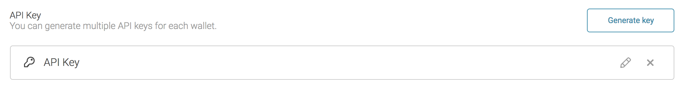

== Introduction

Arkane Network consists of various building blocks, which are used by our applications - like our wallet - and by various clients. You can leverage the power of these building blocks to easily enable blockchain capabilities in your application. 

== Arkane API

=== What

The Arkane API is the core application of Arkane Network. It's a restful API, which consists of various endpoints to:

- View a user's wallets
- Request the balance or token balance of any Arkane Wallet
- Get the profile of a user
- Create signatures using an Arkane Wallet.

=== How
To call an Arkane API, all you need is an endpoint and a valid authentication. 

WARNING: The Arkane API can also be used with API keys instead of Bearer Tokens. Using this authentication method is only encouraged in small scripts.

==== Result Wrapping

All of the API's responses are wrapped in an envelope. This envelope indicates whether the request succeeded. If the request failed, an additional `errors` object is added to the response.

.Example of a successful response
[source,json]
----
{
  "success" : true,
  "result" : {
    "userId" : "davy",
    "hasMasterPin" : true
  }
}
----

.Example of a failed response
[source,json]
----
{
    "success": false,
    "errors": [
        {
            "code": "pincode.no-tries-left",
            "message": "Max pincode tries exceeded"
        }
    ]
}
----

==== Authentication

Calling the Rest API requires authentication. At the moment, the following methods for authentication are available:

* Bearer Token
* API Key

===== Bearer Token

NOTE: A security token with the property that any party in possession of the token (a "bearer") can use the token in any way that any other party in possession of it can. Using a bearer token does not require a bearer to prove possession of cryptographic key material (proof-of-possession).

A Bearer Token is set in the Authorization header of every Inline Action HTTP Request. For example:

----
GET /api/wallets HTTP/1.1
Authorization: Bearer AbCdEf123456
Content-Type: application/json
User-Agent: Mozilla/5.0 (X11; Linux x86_64) AppleWebKit/1.0 (KHTML, like Gecko; Gmail Actions)
----

Bearer tokens can be acquired by using our link:buildingblocks.html#_arkane_identity[[.bb-identity]#Arkane Identity#] component.

===== API Key

API Keys are also supported, in a limited fashion. An API key is generated through the Arkane Webapp and is always linked to a single wallet.

An API key is set in the `authToken` header of every HTTP Request. For example:
----
GET /api/wallets HTTP/1.1
authToken: MW90eUtjTHwzMCVNbUVwcGU3LndLJCwwMDJKLTYtW2pzS0E4ck8yVDBCcSZZNjMjNjg=
Content-Type: application/json
User-Agent: Mozilla/5.0 (X11; Linux x86_64) AppleWebKit/1.0 (KHTML, like Gecko; Gmail Actions)
----

===== Environments

.Production
https://api.arkane.network

.Staging
https://api-staging.arkane.network

==== Limitations

Although the Arkane API supports creating signatures (it's even used as underlying building block of link:buildingblocks.html#_arkane_connect[[.bb-connect]#Arkane Connect#]), creating signatures is only possible when using *API Keys*. The main reason we block signature requests from being performed on other domains is because we don't want the user to enter his *private pin* on an untrusted domain. 

TIP: If you want to create signatures on your own domain, use link:buildingblocks.html#_arkane_connect[[.bb-connect]#Arkane Connect#].

== [[arkane-connect]] ARKANE CONNECT

=== What

Arkane Connect is an endpoint specifically designed to perform common tasks with Arkane wallets. Connect was created as a way to perform tasks which are

* otherwise not possible due to security reasons, *like creating signatures*
* necessary by all applications, like linking wallets your client

Basically, Arkane Connect is a small web application without a central entry point. Calls to Arkane Connect are made by navigating to a specific url. Although you can use it by itself - by manually crafting the urls - we also provide a link:connect-js.html[javascript SDK].  

=== How    

Arkane connect can be called by navigating to a specifically crafted URI. 

There are 2 ways of calling Arkane Connect, the *GET* or *POST* method. For security reasons, we advise to use the *POST* method, as this doesn't leak the short-lived bearer tokens as GET-parameters.

NOTE: Although Arkane Connect can be called natively, we advise you to use the link:connect-js.html[Arkane Connect JS Library] when possible.

==== GET Method

.Example call

`GET`

`https://connect.arkane.network/wallets/manage/vechain?bearerToken=myToken&redirectUrl=https://fundrequest.io`

|=== 
| *url* | The actual url of the action we want to do. This consists of the base url (https://connect.arkane.network) and the endpoint (`wallets/manage/vechain`)
|=== 

===== Query Parameters

|=== 
| *bearerToken* | the security token which performs the authentication.
| *redirectUrl* | the url to redirect to after the action has been performed. If the redirectUrl was not passed, the referer will be used instead.
| *data* | an optional data parameter, which will be used by the specific call. (Example: data to be signed). This should always be *encoded as base64*.
|===

NOTE: Make sure all query parameters are url encoded (ex. https://www.urlencoder.org/)

==== POST Method (recommended)

.Example call

`POST`

`https://connect.arkane.network/wallets/manage/vechain`

===== Query Parameters

|=== 
| *redirectUrl* | the url to redirect to after the action has been performed. If the redirectUrl was not passed, the referer will be used instead.
| *correlationID* | an optional identifier which can be added. Upon navigating back to your *redirectUrl*, after an action was performed, this *correlationID* will be appended to your URL, so the origin can be tracked.  
|=== 

. Post Parameters
|=== 
| *bearerToken* | the security token which performs the authentication. Note: it is also possible to provide this parameter inside the HTTP header “Authorization”
| *data* | an optional data parameter, which will be used by the specific call. (Example: data to be signed). When using the *Post Method*, don't encode as base64.
|===

==== Environments

.Production
https://connect.arkane.network

.Staging
https://connect-staging.arkane.network

== [[arkane-identity]] ARKANE IDENTITY

Our third and final building block is Arkane Identity.
Arkane Identity's sole purpose is to provide a way to authenticate to the Arkane network using OpenID Connect, which combines the OAuth 2.0 protocol together with a simple identity layer.

For your app, you will need a specific "client ID". If you want to connect to our staging environment, which is linked to different testnets then you can us "`Arketype`" as client ID. For connection to the mainnets you will have to connect to our production environment and request your personal client id. (https://arkane-network.typeform.com/to/hzbcGJ[Request your personal client id])

=== Overview
Arkane Network uses https://openid.net/connect/[OpenID Connect]'s Authorization Code Flow footnote:[https://openid.net/specs/openid-connect-core-1_0.html#CodeFlowAuth] for it's authentication and authorization. Below is a guide to obtain a access token manually, but for added security we recommend using a library for handling authentication/authorization. Only use the manual flow if you are very well known with OpenID Connect.

=== Obtaining an access token
==== Step 1 - Request an Authorization Code

Navigate your user to our OpenID Provider. He will be prompted with a form asking him to enter his username and password (when not already authenticated). Once he is authenticated, he will be redirected back to the provided `redirect_uri`, but with a `code` request parameter added to the URI. This must be used in the next step. footnote:[https://openid.net/specs/openid-connect-core-1_0.html#rfc.section.3.1.2]

.URL
https://login.arkane.network/auth/realms/Arkane/protocol/openid-connect/auth

.Request parameters
|===
| Name | Description | Constraints | Example
| client_id | The client_id of your application (provided to you by the Arkane team) | Mandatory | client_id=Arketype
| redirect_uri | The URI of the page you want to be redirected to after authentication (do not forget to URL-encode) | Mandatory | redirect_uri=http%3A%2F%2Flocalhost%3A4000%2F
| scope | The basic (and required) scope for OpenID Connect is the `openid` scope | Mandatory | scope=openid
| response_type | This should always be `code`. It specifies we will be doing the authentication using the https://openid.net/specs/openid-connect-core-1_0.html#CodeFlowAuth[Authorization Code Flow] | Mandatory | response_type=code
| nonce | A string value used to associate a Client session with an ID Token, and to mitigate replay attacks. The value is passed through unmodified from the Authentication Request to the ID Token | Optional | nonce=892b2e8e-cb39-4663-b3e3-4940d4c9ed45
|===

.Example URL
https://login.arkane.network/auth/realms/Arkane/protocol/openid-connect/auth?client_id=Arketype&redirect_uri=http%3A%2F%2Flocalhost%3A4000%2F&scope=openid&response_type=code

.Example of a resulting redirect URI
Look for the `code` request parameter added by our OpenID Provider.
[source,http,options="nowrap"]
----
http://localhost:4000/?session_state=3f365215-13b0-48c1-b6ca-fd73daaa24df&code=eyJhbGciOiJkaXIiLCJlbmMiOiJBMTI4Q0JDLUhTMjU2In0..j2EibasE4A-vK1OKdb4N7Q.akQJKp04OGQOZ6amGQIiwbAr70nv0BYAEMx3jKXKI7RG2R76cnW9OknOfnKjPxZr6dy-7LB1-lFN1W5uhNeMZ5moHNs9B9IPBjMZSafXypSBHj9ANSrGmV71volVRT2r9TU2SHFVS3aF9PLZk556HnxTxZkEXjd5HzL14B6vNdwEv_59OF70yp3HO_TJPBtL65AO6pJ7gtVwjhMuZ6W86p54EWOw5Orvr5E-6Z8fFGBlpXSFpJxvG-duHv8CYL62.yVMr51DCGK3O2kjEvEHvMw
----

==== Step 2 - Request an access and refresh token

To request an access and refresh token, you need to make a `POST` call to the token endpoint of our OpenID Provider, passing it the authorization code that was returned in step 1. footnote:[https://openid.net/specs/openid-connect-core-1_0.html#rfc.section.3.1.3]

.URL
POST https://login.arkane.network/auth/realms/Arkane/protocol/openid-connect/token

.Post body (use x-www-form-urlencoded)
|===
| Name | Description | Example
| client_id | The client_id of your application (provided to you by the Arkane team) | client_id=Arketype
| redirect_uri | The URI of the page you want to be redirected to after authentication (do not forget to URL-encode) | redirect_uri=http://localhost:4000/
| grant_type | This needs to be set to `authorization_code`  | grant_type=authorization_code
| code | The authorization code received in step 1 | code=eyJhbGciOiJkaXIiLCJlbmMiOiJBMTI4Q0JDLUhTMjU2In0..gVMvG7KlZLObMg2OE8MQ7A.3nmUJ5AQ8gEYjN_dNeZKbjH3umoYgrhowD3shIiGxHb5EGLaWwOFTlRnTVVR_BNm0vghzsmOil4qj5jdzZFJSSWbdbz17h-mIMYyfBtMSUwm9qdByD4BgorzX33fF8nqzbr4wPNIEkkqwD9r4CL2JRfNO7zNUuXy6EzYbj7KppCW0418LBCBSePxf9KDtCYSZ3Jr5ajqsm4Quz7Fb8BDA-zmhH5PJiXcA3mY8z3xE0MYXznp1JlQmzri-8mxVGEN.n03Ck3sZtQq3ccGBuEvskA
|===

.Example cURL request
[source,shell,options="nowrap"]
----
curl -X POST \
  https://login.arkane.network/auth/realms/Arkane/protocol/openid-connect/token \
  -H 'Content-Type: application/x-www-form-urlencoded' \
  -d 'client_id=Arketype&redirect_uri=http%3A%2F%2Flocalhost%3A4000&grant_type=authorization_code&code=eyJhbGciOiJkaXIiLCJlbmMiOiJBMTI4Q0JDLUhTMjU2In0..gVMvG7KlZLObMg2OE8MQ7A.3nmUJ5AQ8gEYjN_dNeZKbjH3umoYgrhowD3shIiGxHb5EGLaWwOFTlRnTVVR_BNm0vghzsmOil4qj5jdzZFJSSWbdbz17h-mIMYyfBtMSUwm9qdByD4BgorzX33fF8nqzbr4wPNIEkkqwD9r4CL2JRfNO7zNUuXy6EzYbj7KppCW0418LBCBSePxf9KDtCYSZ3Jr5ajqsm4Quz7Fb8BDA-zmhH5PJiXcA3mY8z3xE0MYXznp1JlQmzri-8mxVGEN.n03Ck3sZtQq3ccGBuEvskA'
----

.Example response
[source,http,options="nowrap"]
----
HTTP/1.1 200 OK
Content-Type: application/json;charset=UTF-8
Content-Length: 600

{
    "access_token": "eyJhbGciOiJSUzI1NiIsInR5cCIgOiAiSldUIiwia2lkIiA6ICJmQi1UenBOb0hBVGhwT2J4aW9qTDBrdm83MldmRzRXRXh1eFpiaXlGQUhzIn0.eyJqdGkiOiJmNTlmNjg0My0zOGJlLTQ4YjEtODQzNi01ZGE0YTdhODRhZTciLCJleHAiOjE1NDY5NDQ3NzQsIm5iZiI6MCwiaWF0IjoxNTQ2OTQyOTc0LCJpc3MiOiJodHRwczovL2xvZ2luLXN0YWdpbmcuYXJrYW5lLm5ldHdvcmsvYXV0aC9yZWFsbXMvQXJrYW5lIiwiYXVkIjoiQXJrZXR5cGUiLCJzdWIiOiI2ZDVlNmU0Yi1jOWUxLTQxODctOGY0Yy0wMzFkNzJjMmU2YWMiLCJ0eXAiOiJCZWFyZXIiLCJhenAiOiJBcmtldHlwZSIsImF1dGhfdGltZSI6MTU0Njg3NDA3OCwic2Vzc2lvbl9zdGF0ZSI6IjNmMzY1MjE1LTEzYjAtNDhjMS1iNmNhLWZkNzNkYWFhMjRkZiIsImFjciI6IjAiLCJhbGxvd2VkLW9yaWdpbnMiOlsiKiJdLCJyZXNvdXJjZV9hY2Nlc3MiOnt9LCJzY29wZSI6Im9wZW5pZCB2aWV3OndhbGxldHMgc2lnbjp3YWxsZXRzIHZpZXc6cHJvZmlsZSBlbWFpbCBwcm9maWxlIiwiZW1haWxfdmVyaWZpZWQiOnRydWUsIm5hbWUiOiJOaWNvIFBlZXRlcnMiLCJwcmVmZXJyZWRfdXNlcm5hbWUiOiJuaWNvLnBlZXRlcnNAYXJrYW5lLm5ldHdvcmsiLCJnaXZlbl9uYW1lIjoiTmljbyIsImZhbWlseV9uYW1lIjoiUGVldGVycyIsImVtYWlsIjoibmljby5wZWV0ZXJzQGFya2FuZS5uZXR3b3JrIn0.D8Bfp5W-UV63K5N2SB3bhBFa3m6xHtl945HfCILluF1PLDV33yNZPNOpRbAb48vILaFHFsBebrJBZURnNjIz2ImxJtSRk-VDJWa8YDMPRrDvctWxZMHBoLaa8qOqoIH-3DnbeUocOzNeh4e2MJdkRKQoIxnpYy-MzIfdGNT0mx8B4zaU3AdLyA2MPEbeKddcnMMouv8jLw8Msl_ZVEBM5B_VoXSo978Jt6A4M1F7hgwVQBwecE65mQtaUJyzu-ygxBf1-inWrCybjy5rn6kNB-Qn0Jl23nE1CChfs2D_4KAXzkg7zNJAx_oUkqlj-yLBkPSRBzYBmJGIu2zMc83b2g",
    "expires_in": 1800,
    "refresh_expires_in": 432000,
    "refresh_token": "eyJhbGciOiJSUzI1NiIsInR5cCIgOiAiSldUIiwia2lkIiA6ICJmQi1UenBOb0hBVGhwT2J4aW9qTDBrdm83MldmRzRXRXh1eFpiaXlGQUhzIn0.eyJqdGkiOiIyMjc4MGE3Yy0zM2E1LTRiM2QtODcwOC04ODM1MDY3MTg3OWMiLCJleHAiOjE1NDczNzQ5NzQsIm5iZiI6MCwiaWF0IjoxNTQ2OTQyOTc0LCJpc3MiOiJodHRwczovL2xvZ2luLXN0YWdpbmcuYXJrYW5lLm5ldHdvcmsvYXV0aC9yZWFsbXMvQXJrYW5lIiwiYXVkIjoiQXJrZXR5cGUiLCJzdWIiOiI2ZDVlNmU0Yi1jOWUxLTQxODctOGY0Yy0wMzFkNzJjMmU2YWMiLCJ0eXAiOiJSZWZyZXNoIiwiYXpwIjoiQXJrZXR5cGUiLCJhdXRoX3RpbWUiOjAsInNlc3Npb25fc3RhdGUiOiIzZjM2NTIxNS0xM2IwLTQ4YzEtYjZjYS1mZDczZGFhYTI0ZGYiLCJyZXNvdXJjZV9hY2Nlc3MiOnt9LCJzY29wZSI6Im9wZW5pZCB2aWV3OndhbGxldHMgc2lnbjp3YWxsZXRzIHZpZXc6cHJvZmlsZSBlbWFpbCBwcm9maWxlIn0.JG9UIO_LrLHChSiNY9gvXdDGYCpfPna1ytVaNOTPB9p6F9kQfB9dGR8JEjX9D9HeYVXQjfhsaLFrX9ZLI1cE_SBxbqWVuLsonyoa0YsTCjUm2R91YC_CGxdECi7mG1g8YvwXMZY0ZoegPEzBTnhpCgC_WT1hZRT1TJek_fi8yWq6DLLoSwM9i4pJyOuJxJ2MvTuxxoLnZ8bNLcAAYS2dyLBoBoJqMGcXRDus0Y4_Nx3PHKfTDSmca5KoDVkrRTHl3WztfhqDotKLaR-99Jq_wqhScAggXWhLH_2WXbBzaOMcXyLJoGpn4wTqN_r8tHAYzHl6-X2rdk7fPYxh9Ii2fA",
    "token_type": "bearer",
    "id_token": "eyJhbGciOiJSUzI1NiIsInR5cCIgOiAiSldUIiwia2lkIiA6ICJmQi1UenBOb0hBVGhwT2J4aW9qTDBrdm83MldmRzRXRXh1eFpiaXlGQUhzIn0.eyJqdGkiOiIyNzZiYTk1NS04OGNiLTRiNjYtYTk3Ni02ZjdjNDU3ZDMxMzciLCJleHAiOjE1NDY5NDQ3NzQsIm5iZiI6MCwiaWF0IjoxNTQ2OTQyOTc0LCJpc3MiOiJodHRwczovL2xvZ2luLXN0YWdpbmcuYXJrYW5lLm5ldHdvcmsvYXV0aC9yZWFsbXMvQXJrYW5lIiwiYXVkIjoiQXJrZXR5cGUiLCJzdWIiOiI2ZDVlNmU0Yi1jOWUxLTQxODctOGY0Yy0wMzFkNzJjMmU2YWMiLCJ0eXAiOiJJRCIsImF6cCI6IkFya2V0eXBlIiwiYXV0aF90aW1lIjoxNTQ2ODc0MDc4LCJzZXNzaW9uX3N0YXRlIjoiM2YzNjUyMTUtMTNiMC00OGMxLWI2Y2EtZmQ3M2RhYWEyNGRmIiwiYWNyIjoiMCIsImVtYWlsX3ZlcmlmaWVkIjp0cnVlLCJuYW1lIjoiTmljbyBQZWV0ZXJzIiwicHJlZmVycmVkX3VzZXJuYW1lIjoibmljby5wZWV0ZXJzQGFya2FuZS5uZXR3b3JrIiwiZ2l2ZW5fbmFtZSI6Ik5pY28iLCJmYW1pbHlfbmFtZSI6IlBlZXRlcnMiLCJlbWFpbCI6Im5pY28ucGVldGVyc0BhcmthbmUubmV0d29yayJ9.bEj8tzYz7KYm0UqbBmVDVAjCXEi6SU6nHzc3dO9h_quibiE88oBMfA2dpwiNh5doih6dLcI02JZlW6wwDXsImidXbbUJY8I6u3OrXGc5dEc7JUbHUUjEu80t-ZctTiWh1H-eM8SW_kJkIAoyyB4tiv8pBqDzwx42-RhzWV34M-OsnbwPFBwl1WCCZa0fBdnq5A8fZvTWqdLyklZlVYYxeFzApxX_0hPe1hEESrv91sLIaYjkSxtNgVVxL7nUSkoH7jMof3PYfFw0uzwLkGJLrdC3hT7m9cYvvw77KPNW7SAQ6KsmKDkpSKzHqTBLoLoz13bq21vaXeCGhKct4lxa8g",
    "not-before-policy": 0,
    "session_state": "3f365215-13b0-48c1-b6ca-fd73daaa24df",
    "scope": "openid view:wallets sign:wallets view:profile email profile"
}
----

==== Step 3 - Refresh the access token

To refresh a token, we can use the same endpoint as in step 2, only this time we supply a different `grant_type` and the refresh token instead of the authorization code. footnote:[https://openid.net/specs/openid-connect-core-1_0.html#rfc.section.12]

.URL
POST https://login.arkane.network/auth/realms/Arkane/protocol/openid-connect/token

.Post body (use x-www-form-urlencoded)
|===
| Name | Description | Example
| client_id | The client_id of your application (provided to you by the Arkane team) | client_id=Arketype
| redirect_uri | The URI of the page you want to be redirected to after authentication (do not forget to URL-encode) | redirect_uri=http://localhost:4000/
| grant_type | This needs to be set to `refresh_token` | grant_type=refresh_token
| refresh_token | The refresh token received in step 2 | refresh_token=eyJhbGciOiJSUzI1NiIsInR5cCIgOiAiSldUIiwia2lkIiA6ICJmQi1UenBOb0hBVGhwT2J4aW9qTDBrdm83MldmRzRXRXh1eFpiaXlGQUhzIn0.eyJqdGkiOiIyMjc4MGE3Yy0zM2E1LTRiM2QtODcwOC04ODM1MDY3MTg3OWMiLCJleHAiOjE1NDczNzQ5NzQsIm5iZiI6MCwiaWF0IjoxNTQ2OTQyOTc0LCJpc3MiOiJodHRwczovL2xvZ2luLXN0YWdpbmcuYXJrYW5lLm5ldHdvcmsvYXV0aC9yZWFsbXMvQXJrYW5lIiwiYXVkIjoiQXJrZXR5cGUiLCJzdWIiOiI2ZDVlNmU0Yi1jOWUxLTQxODctOGY0Yy0wMzFkNzJjMmU2YWMiLCJ0eXAiOiJSZWZyZXNoIiwiYXpwIjoiQXJrZXR5cGUiLCJhdXRoX3RpbWUiOjAsInNlc3Npb25fc3RhdGUiOiIzZjM2NTIxNS0xM2IwLTQ4YzEtYjZjYS1mZDczZGFhYTI0ZGYiLCJyZXNvdXJjZV9hY2Nlc3MiOnt9LCJzY29wZSI6Im9wZW5pZCB2aWV3OndhbGxldHMgc2lnbjp3YWxsZXRzIHZpZXc6cHJvZmlsZSBlbWFpbCBwcm9maWxlIn0.JG9UIO_LrLHChSiNY9gvXdDGYCpfPna1ytVaNOTPB9p6F9kQfB9dGR8JEjX9D9HeYVXQjfhsaLFrX9ZLI1cE_SBxbqWVuLsonyoa0YsTCjUm2R91YC_CGxdECi7mG1g8YvwXMZY0ZoegPEzBTnhpCgC_WT1hZRT1TJek_fi8yWq6DLLoSwM9i4pJyOuJxJ2MvTuxxoLnZ8bNLcAAYS2dyLBoBoJqMGcXRDus0Y4_Nx3PHKfTDSmca5KoDVkrRTHl3WztfhqDotKLaR-99Jq_wqhScAggXWhLH_2WXbBzaOMcXyLJoGpn4wTqN_r8tHAYzHl6-X2rdk7fPYxh9Ii2fA
|===

.Example cURL request
[source,shell,options="nowrap"]
----
curl -X POST \
  https://login.arkane.network/auth/realms/Arkane/protocol/openid-connect/token \
  -H 'Content-Type: application/x-www-form-urlencoded' \
  -d 'client_id=Arketype&redirect_uri=http%3A%2F%2Flocalhost%3A4000%2F&grant_type=refresh_token&refresh_token=eyJhbGciOiJSUzI1NiIsInR5cCIgOiAiSldUIiwia2lkIiA6ICJmQi1UenBOb0hBVGhwT2J4aW9qTDBrdm83MldmRzRXRXh1eFpiaXlGQUhzIn0.eyJqdGkiOiIyMjc4MGE3Yy0zM2E1LTRiM2QtODcwOC04ODM1MDY3MTg3OWMiLCJleHAiOjE1NDczNzQ5NzQsIm5iZiI6MCwiaWF0IjoxNTQ2OTQyOTc0LCJpc3MiOiJodHRwczovL2xvZ2luLXN0YWdpbmcuYXJrYW5lLm5ldHdvcmsvYXV0aC9yZWFsbXMvQXJrYW5lIiwiYXVkIjoiQXJrZXR5cGUiLCJzdWIiOiI2ZDVlNmU0Yi1jOWUxLTQxODctOGY0Yy0wMzFkNzJjMmU2YWMiLCJ0eXAiOiJSZWZyZXNoIiwiYXpwIjoiQXJrZXR5cGUiLCJhdXRoX3RpbWUiOjAsInNlc3Npb25fc3RhdGUiOiIzZjM2NTIxNS0xM2IwLTQ4YzEtYjZjYS1mZDczZGFhYTI0ZGYiLCJyZXNvdXJjZV9hY2Nlc3MiOnt9LCJzY29wZSI6Im9wZW5pZCB2aWV3OndhbGxldHMgc2lnbjp3YWxsZXRzIHZpZXc6cHJvZmlsZSBlbWFpbCBwcm9maWxlIn0.JG9UIO_LrLHChSiNY9gvXdDGYCpfPna1ytVaNOTPB9p6F9kQfB9dGR8JEjX9D9HeYVXQjfhsaLFrX9ZLI1cE_SBxbqWVuLsonyoa0YsTCjUm2R91YC_CGxdECi7mG1g8YvwXMZY0ZoegPEzBTnhpCgC_WT1hZRT1TJek_fi8yWq6DLLoSwM9i4pJyOuJxJ2MvTuxxoLnZ8bNLcAAYS2dyLBoBoJqMGcXRDus0Y4_Nx3PHKfTDSmca5KoDVkrRTHl3WztfhqDotKLaR-99Jq_wqhScAggXWhLH_2WXbBzaOMcXyLJoGpn4wTqN_r8tHAYzHl6-X2rdk7fPYxh9Ii2fA'
----

.Example response
[source,http,options="nowrap"]
----
HTTP/1.1 200 OK
Content-Type: application/json;charset=UTF-8
Content-Length: 600

{
    "access_token": "eyJhbGciOiJSUzI1NiIsInR5cCIgOiAiSldUIiwia2lkIiA6ICJmQi1UenBOb0hBVGhwT2J4aW9qTDBrdm83MldmRzRXRXh1eFpiaXlGQUhzIn0.eyJqdGkiOiJjOGFjMzUxYy0wODZjLTQ3YjQtOTE4Ni02ZjI3Yjk5YTIzNWIiLCJleHAiOjE1NDY5NDU0ODgsIm5iZiI6MCwiaWF0IjoxNTQ2OTQzNjg4LCJpc3MiOiJodHRwczovL2xvZ2luLXN0YWdpbmcuYXJrYW5lLm5ldHdvcmsvYXV0aC9yZWFsbXMvQXJrYW5lIiwiYXVkIjoiQXJrZXR5cGUiLCJzdWIiOiI2ZDVlNmU0Yi1jOWUxLTQxODctOGY0Yy0wMzFkNzJjMmU2YWMiLCJ0eXAiOiJCZWFyZXIiLCJhenAiOiJBcmtldHlwZSIsImF1dGhfdGltZSI6MTU0Njg3NDA3OCwic2Vzc2lvbl9zdGF0ZSI6IjNmMzY1MjE1LTEzYjAtNDhjMS1iNmNhLWZkNzNkYWFhMjRkZiIsImFjciI6IjAiLCJhbGxvd2VkLW9yaWdpbnMiOlsiKiJdLCJyZXNvdXJjZV9hY2Nlc3MiOnt9LCJzY29wZSI6Im9wZW5pZCB2aWV3OndhbGxldHMgc2lnbjp3YWxsZXRzIHZpZXc6cHJvZmlsZSBlbWFpbCBwcm9maWxlIiwiZW1haWxfdmVyaWZpZWQiOnRydWUsIm5hbWUiOiJOaWNvIFBlZXRlcnMiLCJwcmVmZXJyZWRfdXNlcm5hbWUiOiJuaWNvLnBlZXRlcnNAYXJrYW5lLm5ldHdvcmsiLCJnaXZlbl9uYW1lIjoiTmljbyIsImZhbWlseV9uYW1lIjoiUGVldGVycyIsImVtYWlsIjoibmljby5wZWV0ZXJzQGFya2FuZS5uZXR3b3JrIn0.Q9ZHUZirAmGINNX6nJzZPnQZrXys6_LL9tj2ciEzPzc_MbuXfyDjfklsuQbp3ERbNFsoudRpG5XFIRIK_rKIDw9wr1ASGhFub8Lu1Gin8m9SmXf_FtqTkCK2m2A-ilj1UVbtF3itQwNaEmNGKeS9wpwkE6NloK6zB8hmAvVkW1mj_t2DMqPV-NhsNyCorLtBUgRCtNhwjzbbHcxKApAi4TbTaDHUF57sILkxzZwUTseory1W23nhhcYbZt7HbkoUXZvMalrh--lv2-rp1LCkUg3jijY3SEgltxrkX2GmyoGNu1NGwTgnF63A70OfiRCoCx8qZ1ZZ4A2-HAOFDDvJjA",
    "expires_in": 1800,
    "refresh_expires_in": 431999,
    "refresh_token": "eyJhbGciOiJSUzI1NiIsInR5cCIgOiAiSldUIiwia2lkIiA6ICJmQi1UenBOb0hBVGhwT2J4aW9qTDBrdm83MldmRzRXRXh1eFpiaXlGQUhzIn0.eyJqdGkiOiI4NGFiNGQ4YS0xMzA0LTQxZDItYjU0MS0yMmYzYTliMmNhYWMiLCJleHAiOjE1NDczNzU2ODgsIm5iZiI6MCwiaWF0IjoxNTQ2OTQzNjg4LCJpc3MiOiJodHRwczovL2xvZ2luLXN0YWdpbmcuYXJrYW5lLm5ldHdvcmsvYXV0aC9yZWFsbXMvQXJrYW5lIiwiYXVkIjoiQXJrZXR5cGUiLCJzdWIiOiI2ZDVlNmU0Yi1jOWUxLTQxODctOGY0Yy0wMzFkNzJjMmU2YWMiLCJ0eXAiOiJSZWZyZXNoIiwiYXpwIjoiQXJrZXR5cGUiLCJhdXRoX3RpbWUiOjAsInNlc3Npb25fc3RhdGUiOiIzZjM2NTIxNS0xM2IwLTQ4YzEtYjZjYS1mZDczZGFhYTI0ZGYiLCJyZXNvdXJjZV9hY2Nlc3MiOnt9LCJzY29wZSI6Im9wZW5pZCB2aWV3OndhbGxldHMgc2lnbjp3YWxsZXRzIHZpZXc6cHJvZmlsZSBlbWFpbCBwcm9maWxlIn0.RWNxeXX9HkiFouanoZyQJWORu3svN0cgVDgqcPKb1xgftpvnp8a1lY9cmvdPuTKDaz9J4knU5EXzo_H1_CC4A1P9LqSVAByEsa_KlFaCCNozSYvMKoVhEJ3ujmnKvrKrT6Cv_O6bewky3lmulsOl_1q8C-CyJTQ8A7GTR9_YxJC6j7T7c6SrWOsxDV7XHtfSiO-TwxLbq7XI6q9gjP1f1OXbFlOU3enk9RmgR9xR4dOlkEA9Izz6SP5TFF64GI0aUpkUz1dzTXHp5fX0V7VGvLH9-NHP76cGhHCWD159P3yfjbJtTdyXlbRQ2EaSc3_HL9A3IhwpGUDeno6SJT6y0g",
    "token_type": "bearer",
    "id_token": "eyJhbGciOiJSUzI1NiIsInR5cCIgOiAiSldUIiwia2lkIiA6ICJmQi1UenBOb0hBVGhwT2J4aW9qTDBrdm83MldmRzRXRXh1eFpiaXlGQUhzIn0.eyJqdGkiOiI1YjM0MzE5MS05OTI1LTRhZTktYTkxYi03NDU3ZTIxYTA5NjgiLCJleHAiOjE1NDY5NDU0ODgsIm5iZiI6MCwiaWF0IjoxNTQ2OTQzNjg4LCJpc3MiOiJodHRwczovL2xvZ2luLXN0YWdpbmcuYXJrYW5lLm5ldHdvcmsvYXV0aC9yZWFsbXMvQXJrYW5lIiwiYXVkIjoiQXJrZXR5cGUiLCJzdWIiOiI2ZDVlNmU0Yi1jOWUxLTQxODctOGY0Yy0wMzFkNzJjMmU2YWMiLCJ0eXAiOiJJRCIsImF6cCI6IkFya2V0eXBlIiwiYXV0aF90aW1lIjoxNTQ2ODc0MDc4LCJzZXNzaW9uX3N0YXRlIjoiM2YzNjUyMTUtMTNiMC00OGMxLWI2Y2EtZmQ3M2RhYWEyNGRmIiwiYWNyIjoiMCIsImVtYWlsX3ZlcmlmaWVkIjp0cnVlLCJuYW1lIjoiTmljbyBQZWV0ZXJzIiwicHJlZmVycmVkX3VzZXJuYW1lIjoibmljby5wZWV0ZXJzQGFya2FuZS5uZXR3b3JrIiwiZ2l2ZW5fbmFtZSI6Ik5pY28iLCJmYW1pbHlfbmFtZSI6IlBlZXRlcnMiLCJlbWFpbCI6Im5pY28ucGVldGVyc0BhcmthbmUubmV0d29yayJ9.EiQduMLXUF4AsgYBe_bMVN1Nci4bMz4iqIAAdEX8E4SFB4uWUY4Ffdc4ETmwQV8QfVyc38d94j-ZK6MTAMrBK1eDIXwGZfSfdF_6JHoKQGpZcwCBol9izktqpRBfZVEGulD4LRfd4p0N0MqJ45UzI7f8F40UXyC14aY1VH7kRIHdZQ3nRICdwQxuBC2eRUA7Y2fTr5mbEnVK15rXuxAbgjSRYFrhfoOdNUnF-mjLE1QKDeeumyZFqtRmioZFOilzAd7guEPrOmjstrHuJ77CkSP6rKzE2yQV9k2V7QDEwqwda6sx7iGq1C4EWlTtgduvl4vhzgEkDRdDGrmvVEUAWg",
    "not-before-policy": 0,
    "session_state": "3f365215-13b0-48c1-b6ca-fd73daaa24df",
    "scope": "openid view:wallets sign:wallets view:profile email profile"
}
----

=== Useful endpoints

==== 'well-known'
.URL
.Example response
[source,http,options="nowrap"]
----
GET https://login.arkane.network/auth/realms/Arkane/.well-known/openid-configuration
----

Lists endpoints and other configuration options relevant to the OpenID Connect implementation

==== Authorization
.URL
.Example response
[source,http,options="nowrap"]
----
GET https://login.arkane.network/auth/realms/Arkane/protocol/openid-connect/auth
----

This endpoint performs authentication of the user. This is done by redirecting the user to this endpoint (see _step 1_ above).

==== Token
.URL
.Example response
[source,http,options="nowrap"]
----
GET https://login.arkane.network/auth/realms/Arkane/protocol/openid-connect/token
----

This endpoint is used to obtain tokens. Tokens can either be obtained by exchanging an authorization code or by supplying a refresh token (see _step 2_ and _step 3_ above)

==== Userinfo
.URL
.Example response
[source,http,options="nowrap"]
----
GET https://login.arkane.network/auth/realms/Arkane/protocol/openid-connect/userinfo
----

This endpoint returns standard information about the authenticated user

==== Logout
.URL
.Example response
[source,http,options="nowrap"]
----
GET https://login.arkane.network/auth/realms/Arkane/protocol/openid-connect/logout
----
.Request parameters
|===
| Name | Description | Constraints | Example
| redirect_uri | The URI of the page you want to be redirected to after login out (do not forget to URL-encode) | Mandatory | redirect_uri=http%3A%2F%2Flocalhost%3A4000%2F
|===

This endpoint logs out the authenticated user. +
The user can be redirected to the endpoint, in which case the active user session is logged out. Afterward the user is redirected back to the application. +
The endpoint can also be invoked directly by the application. To invoke this endpoint directly the refresh token needs to be included as well as the credentials required to authenticate the client.

==== Certificates
.URL
.Example response
[source,http,options="nowrap"]
----
GET https://login.arkane.network/auth/realms/Arkane/protocol/openid-connect/certs
----

This endpoint returns the public keys enabled by the realm, encoded as a JSON Web Key (JWK).

=== Environments

.Production
url: https://login.arkane.network

client id: _Request a specific application client id_

.Staging
url: https://login-staging.arkane.network

client id: `Arketype`
